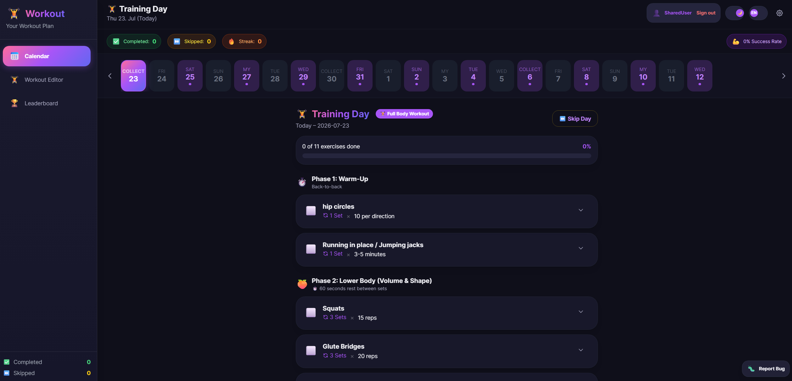

# 🏋️ WorkoutPlaner App

A modern, responsive web application for managing workout routines, tracking calendar progress with a 14-day schedule, creating multi-workout routines, uploading custom exercise GIFs & images (up to 25MB), and tracking performance with a global leaderboard.




---

## 📖 Table of Contents

- [✨ Features](#-features)
- [🛠️ Tech Stack](#️-tech-stack)
- [🚀 Quick Start & Installation](#-quick-start--installation)
- [🐳 Running with Docker](#-running-with-docker)
- [📂 Project Structure](#-project-structure)
- [📡 API Endpoints](#-api-endpoints)
- [🌍 Internationalization (i18n)](#-internationalization-i18n)
- [💾 Data Persistence](#-data-persistence)

---

## ✨ Features

### 📅 14-Day Calendar View & Tracking
- **Interactive Calendar Bar**: Visual 14-day timeline displaying scheduled workout badges, rest days, and completed workouts.
- **Actionable Workouts**: Mark workouts as complete with celebration effects (confetti & motivation GIFs) or skip days with designated reasons (e.g., sore muscles, busy schedule).
- **Progress Tracking**: Real-time progress bar tracking completed exercises percentage per day.

### 🏋️‍♂️ Multi-Workout Routine Management
- **Multiple Workout Routines**: Create and maintain separate routines (e.g., *Full Body*, *Push/Pull/Legs*, *Core Fokus*).
- **Flexible Scheduling**:
  - **Interval Rhythm**: Train periodically every 1–7 days.
  - **Fixed Weekdays**: Train on specific days of the week (e.g., Monday, Wednesday, Friday).
- **Automatic Scheduling**: Calculates the next active training day automatically based on the active routine.

### 🖼️ Exercise GIFs & Image Uploads (Drag & Drop up to 25MB)
- **Drag & Drop Upload Zone**: Upload custom exercise GIFs or image files up to 25MB via drag & drop or file picker.
- **Live Preview**: Instant thumbnail preview of the uploaded file inside the modal.
- **Preset Illustration Library**: Select from pre-packaged exercise illustrations (Squats, Plank, Crunches, Lunges, etc.) or provide custom external image URLs.

### ✏️ Workout Editor
- **Phases & Exercises Builder**: Organize workouts into phases (e.g., *Warm-Up*, *Main Part*, *Cool-Down*) and add custom exercises.
- **Full Customization**: Edit exercise names, sets, rep counts, descriptions, and GIF/image URLs via the edit button (✏️).
- **Reordering**: Easily shift phases and exercises up or down.

### 🌍 Fully Bilingual (English & German)
- **Real-Time Language Switcher**: Toggle between English (EN) and German (DE) in the navigation header.
- **System-Wide Translation**: Modals, buttons, calendar labels, toast notifications, and descriptions update instantly without page reloads.

### 🌓 Dark & Light Mode
- **Theme Switcher**: Seamless dark and light theme switching.
- **Persistence**: Theme settings are saved locally and applied without initial loading flashes.

### 🏆 Leaderboard & Stats
- **User Leaderboard**: Global leaderboard ranking users based on completed workouts and current streaks.
- **Personal Statistics**: Comprehensive view of completed workouts, skipped days, and active streaks.

---

## 🛠️ Tech Stack

- **Backend**: Node.js, Express.js 5
- **Frontend**: Vanilla JavaScript (ES6+ Modular Architecture), HTML5, CSS3
- **Styling**: TailwindCSS, CSS Variables, Glassmorphism Design System
- **Build Tools**: PostCSS, Autoprefixer, Concurrently, Nodemon
- **Containerization**: Docker, Docker Compose

---

## 🚀 Quick Start & Installation

### Prerequisites
- **Node.js** `>= 20.0.0`
- **npm** `>= 10.0.0`

### 1. Clone Repository & Install Dependencies:
```bash
git clone https://github.com/YozouChan/cal.git
cd cal
npm install
```

### 2. Run Development Server:
Launches the Node.js server (with Nodemon) and the TailwindCSS watcher concurrently:
```bash
npm run dev
```
Access the application at **`http://localhost:3000`**.

### 3. Production Start:
```bash
npm start
```

---

## 🐳 Running with Docker

The application is containerized and ready for deployment using **Docker Compose**.

### Quick Start with Docker Compose:
```bash
docker compose up -d --build
```

### Status & Logs:
```bash
# Check container status
docker compose ps

# View live logs
docker compose logs -f

# Stop containers
docker compose down
```

*For more details on Docker CLI commands, refer to [`DOCKER.md`](DOCKER.md).*

---

## 📂 Project Structure

```
cal/
├── public/                     # Static frontend assets
│   ├── assets/                 # Default exercise illustrations & motivation GIFs
│   ├── css/                    # Compiled Tailwind CSS output
│   ├── js/                     # Modular Frontend JavaScript
│   │   ├── components/         # UI components (Modal, Calendar-Bar, Day-View, Workout-Card, Sidebar)
│   │   ├── modules/            # Business logic (Editor, I18n, Theme, ApiClient, Leaderboard, Stats)
│   │   └── app.js              # Frontend entry point
│   ├── pages/                  # HTML Views (Calendar, Editor, Leaderboard, Settings, Login)
│   └── uploads/                # User uploaded images & GIFs (max 25MB)
├── routes/                     # Express Router
│   ├── api.js                  # REST API endpoints (/api/*)
│   └── pages.js                # HTML Page Routes
├── src/                        # Source build assets
│   ├── data/                   # Default template data (workout-data.json)
│   └── styles/                 # Tailwind Input CSS (input.css)
├── data/                       # Per-user persistent storage (state.json)
├── Dockerfile                  # Docker Container definition
├── docker-compose.yml          # Docker Compose configuration
├── DOCKER.md                   # Detailed Docker guide
├── server.js                   # Express server entry point
└── package.json                # NPM configuration & dependencies
```

---

## 📡 API Endpoints

### 🔑 Auth & Session
- `POST /api/auth/login` – Login with username & passphrase
- `POST /api/auth/logout` – Logout active session
- `POST /api/auth/delete-account` – Delete user account & user data

### 🏋️ Workouts & Routines
- `GET /api/workout` – Fetch workout routines and active routine
- `POST /api/workout` – Create a new workout routine
- `PUT /api/workout/:id` – Update workout routine settings (name, rhythm, weekdays)
- `POST /api/workout/select` – Switch active routine
- `DELETE /api/workout/:id` – Delete workout routine

### 🧘 Exercises & Phases
- `POST /api/workout/exercise` – Add a new exercise to a phase
- `PUT /api/workout/exercise/:id` – Update exercise details (name, sets, reps, description, gifUrl)
- `DELETE /api/workout/exercise/:id` – Remove an exercise
- `PATCH /api/workout/exercise/reorder` – Reorder exercises within a phase
- `PATCH /api/workout/phase/reorder` – Reorder workout phases

### 📤 File Upload
- `POST /api/upload` – Upload image or GIF file (up to 25MB) and receive public URL

### 📅 Calendar & Progress
- `GET /api/calendar` – Retrieve 14-day calendar timeline
- `POST /api/calendar/complete` – Mark workout day as completed
- `POST /api/calendar/skip` – Skip workout day with reason
- `DELETE /api/calendar/skip` – Undo skipped day

### 🏆 Leaderboard & Stats
- `GET /api/leaderboard` – Retrieve global user rankings
- `GET /api/stats` – Retrieve user performance stats

---

## 🌍 Internationalization (i18n)

Multilingual support is managed by [`i18n.js`](public/js/modules/i18n.js):
- **Languages**: English (`en`) and German (`de`).
- **Default**: English is selected by default on first visit and persisted in `localStorage`.

---

## 💾 Data Persistence

User data is stored file-based in the `data/` and `public/uploads/` directories:
- **`data/users/`**: Stores isolated workout plans, states, and statistics per user.
- **`public/uploads/`**: Stores custom uploaded exercise images and GIFs.

When running in **Docker**, these directories are mounted as volumes so data remains intact across container rebuilds and updates.

---

## 📜 License

This project is licensed under the **ISC License**.<br>
Created by **YozouChan**.
